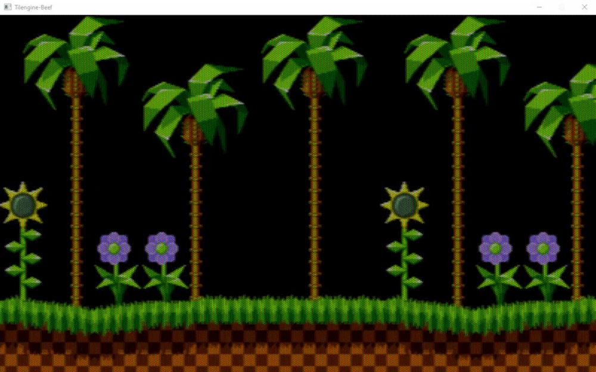

# Tilengine-Beef
**Tilengine-Beef** is a work in progress Beef wrapper library for **Tilengine 2.7.0** 2D graphics engine. It seems to be up and working for the most part, but there are bugs and not everything is working exactly as it should such as the input, and a few things like calling null to some functions. Below I have listed the things I can't figure out how to get working right, so if anyone could take a look and help me out that would be much appreciated.

## TODO:
- Figure out how to get Fixed point helper in src\Tilengine.bf (Line 18-24) to work with Beef.
- Make sure Callbacks in src\Tilengine.bf (Line 27-31) are done/working correctly.
- Figure out why src\Enums\Input.bf (Line 21-24)  Beef thinks these aren't new values, and why it's "unable to implicitly cast 'int' to 'TLN.Enums.Player'"
- Figure out why I can't pass null to certain functions as I should beable to in C. For example if I try to set a Layer using TLN.SetLayer(0, null, foreground) I get an error saying "unable to implicitly cast 'null' to 'TLN.Types.Tileset'"
- Rewrite examples to Beef


# Quick Start *(using Beef IDE)*
1. **Download** Tilengine-beef and copy it here: **C:\Program Files\BeefLang\BeefLibs**
2. Right-click on your workspace and select **Add from Installed** and choose Tilengine
3. **Make** Tilengine **as a dependency** of your project 
4. Write some code

# Example Code

```
using Tilengine;
using TLN.Types;
using TLN.Data;
using System;

namespace TilengineTest
{
	public static class Program : TLN
	{
		public static void Main()
		{
			Tilemap foreground;
			Tileset tileset;
			int frame = 0;

			Init(400,240,1,0,20);
			SetLoadPath("assets/sonic");
			foreground = LoadTilemap("Sonic_md_fg1.tmx", null);
			tileset = LoadTileset("Sonic_md_fg1.tsx");
			SetLayer(0, tileset, foreground);

			CreateWindow(null, 0);
			SetWindowTitle("Tilengine-Beef");

			while (ProcessWindow())
			{
				DrawFrame (frame);
				frame += 1;
			}
			Deinit();
			
		}
	}
}
```

# More Info
- More info about **Tilengine** (https://github.com/megamarc/Tilengine/)
- More info about **BeefLang** (https://www.beeflang.org)

# Contribution

If you can make this work right please do! 
